# Performance Testing on Dedicated Hardware

## Introduction

We seek to demonstrate the benefits of the Netty stack over Tomcat when utilising non-blocking IO inbound and outbound and zero-copy buffer transfer.

An experiment will be carried out to tune and stress both implementations, measuring throughput and latency as strain effects surface.

## Take Aways - For the Impatient
-   Non-blocking inbound and outbound IO performs much better in terms of linear scalability. A caveat is that all processing filters employed in the proxy must never block the execution stage threads i.e. they must use non-blocking outbound IO e.g. if config services are being contacted by filters synchronously.
-   Time spent in GC is reduced significantly by Netty so long as the request and response buffers are not intercepted in processing filters. Doing so would drag the content into user space and cause an increase in GC utilisation. We chose to carefully expose only the minimum request and response data in the filter API so that the framework developers can make guarantees to filter developers about performance.
-   Netty becomes non-linear in the face of a lot of inbound connection churn. The APR connector performs much better in this case. It should be noted that the performance characteristic is most predictable when a system in our control (e.g. loadbalancer) can guarantee that keep alives will be maintained with the proxy in the face of inbound connection churn.

## Method

### Equipment and Tool Specification
-   Intel(R) Xeon(R) CPU E5430 @ 2.66GHz (dual quad core - total 8 CPU cores).
-   Single 1Gbps NICs employed on each server.
-   Unspecified Production-grade, low-latency networking equipment utilised for interconnects.
-   Mixture of WRK load generator and HP LoadRunner used to provide a sample probe.

### Configuration

#### Zuul-Netty Configuration
##### JVM
-   -server
-   -Xms1500m
-   -Xmx1500m
-   -Xmn500m
-   -XX:+UseParallelGC
-   -XX:+UseCompressedOops
-   -XX:+PrintFlagsFinal

##### Framework
-   -Dxorg.jboss.netty.epollBugWorkaround=true
    *- enable the epoll CPU fix, although not experienced*
-   -Dxorg.jboss.netty.selectTimeout=10        
    *- the default, has affect only when idling.*
-   -Dcom.netflix.zuul.workers.inbound=4       
    *- limit inbound IO workers to 4 threads (half the cores)*
-   -Dcom.netflix.zuul.workers.stage=8         
    *- limit execution stage threads to the number of cores*
-   -Dcom.netflix.zuul.workers.outbound=4      
    *- limit outbound IO workers to 4 threads (half the cores)*

#### Zuul-Tomcat Configuration
##### JVM
-   -server
-   -Xms3500m
-   -Xmx3500m
-   -Xmn1024m
-   -XX:+UseParallelGC
-   -XX:+UseCompressedOops
-   -XX:+PrintFlagsFinal

##### Framework
-   -Dzuul.max.host.connections=5000           
    *- set to ensure no pool bottleneck*

##### APR Connector 
-   maxKeepAliveRequests="5000"
-   maxThreads="5000"
-   connectionTimeout="20000"
-   acceptorThreadCount="2"
-   maxKeepAliveRequests="5000"
-   maxThreads="5000"
-   socketBuffer="15000"
-   pollTime="5000"

#### OS 
-   net.core.rmem_max = 8388608 
    *- increase read buffer size*
-   net.core.wmem_max = 8388608 
    *- increase write buffer size*
-   net.core.netdev\_max_backlog = 5000 
    *- increase the maximum number of packets queued on the INPUT side, especially when the NIC receives packets faster than kernel can process them*
-   net.core.somaxconn = 5000 
    *- increase the maximum number of inbound connections allowed*
-   net.ipv4.tcp\_max\_syn_backlog = 5000 
    *- increase the backlog per port to surface queueing effects*

### Test Scenario

The load test scenario was simulated using the “wrk benchmark” tool which was sending requests through KeepAlive connections against a target stub which simulated a random 1k payload with a 50ms uniform latency. In a realistic scenario we assume this implementation will be behind a Netscaler/VIP which would reuse connections instead of frequent connections open/close.

## Highlights of Observations

-   We have successfully achieved the objective of tuning the Zuul-Netty port (Zuul-Netty) to reach linear scalability compared to the Netflix Zuul project running atop Tomcat (Zuul-Tomcat) version and highlight the benefits of nonblocking IO. To achieve this we did some TCP tweaks and added overrides for the netty’s IO threads.
-   We observed that, comparatively, Tomcat’s APR connector was much more efficient in cases where there was no KeepAlive, i.e every request involved the client opening a TCP connection to the proxy.
-   The scalability point with respect to Tomcat vs Netty was determined by discounting the overheads/latencies incurred in the time spent in processing the response content as this is noise present in both tests. Based on the table below, we can conclude that the scalability point of Zuul-Tomcat was achieved at 1300 concurrent connections with a throughput of around 16K TPS, whereas the Netty implementation was linearly scalable [we tested upto 2000 connections ~ 28K TPS].
-   The Zuul-Netty response times for maximum load of 2000 connections was around 71 ms, that is a total of ~21ms spent on the wire and in the proxy. The difference in the response time at each load level was almost uniform, this can be attributed to the overhead of processing the increasing server load [overhead of the HTTP codec/network latencies within the stream, @max load we were using 680Mbps on a 1G NIC and network saturation effects contributed to an increase in latency at this load level].
-   The Zuul-Tomcat response times started to increase significantly with increasing connections, which is a composite effect of blocking connections, frequent GC and high number of busy worker threads. This is reflected in the Operating system’s run queue length and the JVM’s GC throughput. Comparison graphs can be found below.

## Detailed Observations

### Results for Ramped Load Test
Run     |Con.   |Rq./s     |Av./ms     |TP50/ms       |TP75/ms        |TP90/ms        |CPU/%  |LdAvg      |Ctx Sw.            |Mbps
---     |--:    |--:       |--:        |--:           |--:            |--:            |--:    |--:        |--:                |--:
Tomcat	 |700	   |12148	    |61.25	     |53.51	        |54.63	         |58.00	        |61.02	|9.30	    |71946.30	        |306.81
Netty	  |700	   |13283	    |52.65	     |52.10	        |52.83	         |54.25	        |47.32	|6.93	    |93207.48	        |313.06
Tomcat	 |900	   |15277	    |71.55	     |54.80	        |57.29      	   |64.19	        |74.12	|14.85	    |74591.69       	|373.70
Netty	  |900	   |16701	    |54.01	     |52.72	        |54.24      				|56.98	        |57.50	|7.93	    |89477.57       	|400.00
Tomcat	 |1100	  |15385	    |6410.00    |58.81	        |71.22      	|58000.00	    |79.57	|18.10	    |69413.10       	|367.46
Netty	  |1100	  |19806	    |55.71	     |53.73	        |56.48      	|60.80	        |64.23	|8.60	    |80201.63       	|475.56
Tomcat	 |1300	  |16161	    |1940.00 	  |70.10	        |88.83      	|154.94	        |83.18	|19.79	    |69286.21	        |379.87
Netty	  |1300	  |22461	    |57.86	     |55.22	        |60.06      	|67.43	        |70.43	|9.12	    |71283.04	        |540.41
Tomcat	 |1500	  |16215	    |109.96	    |85.35	        |113.29     	|151.89	        |84.26	|20.37	    |72201.76	        |392.80
Netty	  |1500	  |24294	    |61.70	     |57.42	        |64.68      	|77.24	        |73.89	|9.22	    |62635.39	        |586.07
Tomcat	 |1700	  |16137  	  |110.83	    |96.36	        |130.57	        |167.38	        |84.66	|21.72	    |71682.80	        |386.01
Netty	  |1700	  |26012	    |65.29	     |59.68	        |68.80       	|85.59	        |75.57	|9.34	    |56936.30	        |627.89
Tomcat	 |1900	  |15759	    |136.60	    |113.63	       |155.77     	|203.54	        |85.13	|21.33	    |69941.45	        |377.01
Netty	  |1900	  |27585	    |68.74	     |62.19	        |72.91      	|92.45      	|77.54	|9.62	    |51156.29	        |666.63
Tomcat	 |2000	  |15564	    |159.26	    |120.93	       |166.95     	|218.64        	|65.08	|16.75	    |54500.02	        |291.12
Netty	  |2000	  |28196	    |70.87	     |63.92	        |75.58      	|96.34      	|78.96	|9.71	    |48146.36       	|682.39

### Aggregate Performance fn(connections)
Observed Performance                | Resource Utilisation
:-:                                 |:-:
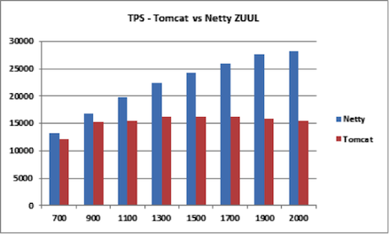              |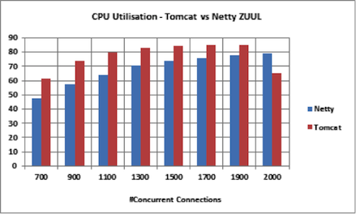
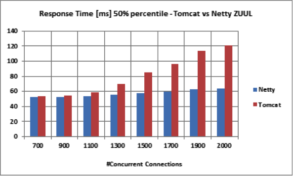            |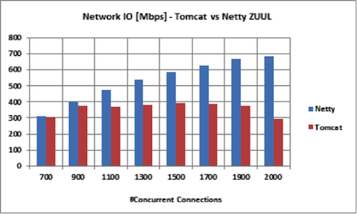
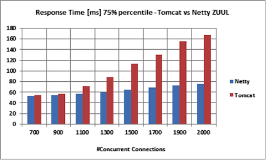            |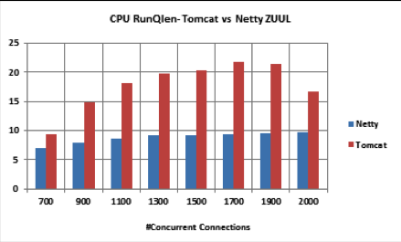

### Result Samples fn(time)
Zuul running on Tomcat                                      |Zuul-Netty
:-:                                                         |:-:
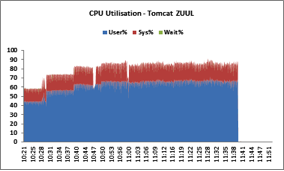           |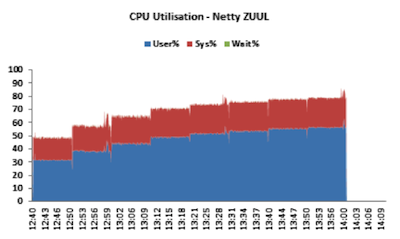
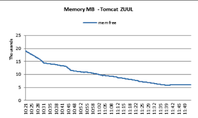           |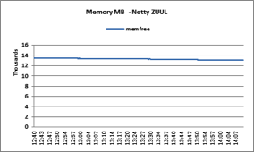
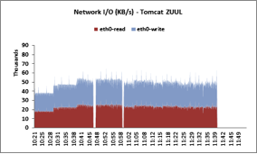            |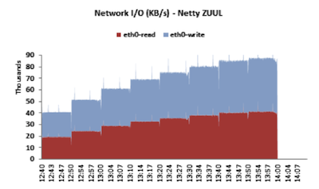
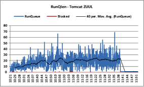          |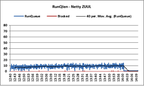
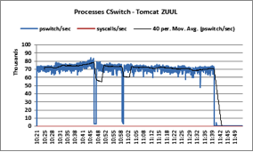      |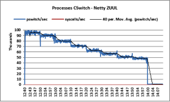
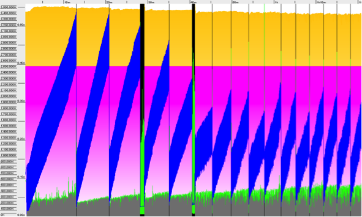                         |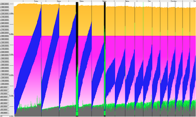

### Observed Benefits of Zuul-Netty
It is clear that Zuul-Netty has a much more stable performance characteristic than Zuul-Tomcat.
 -  Non blocking inbound AND outbound IO.
    The threads doing the useful filter work never block and so can be set to a fixed number, equal to the number of cores. This has the effect of preventing contention for CPU resource, something which was observed in Zuul-Tomcat.
 -  During profiling and thread activity analysis of the Netty instance we observed that the major contributor was the Selector method, hence reducing the inbound and outbound IO worker threads [default: 2*no of CPUs] helped us save some CPU cycles. These values need to be determined as per the application usage.
 -  Efficiently utilizes the system resources like CPU/network. Even higher throughput can be achieved with bonded or dedicated NICs. Depending upon the additional tasks on the proxy layer we might need additional CPU capacity.
 -  High number of connections doesn’t affect the stability of the ZUUL proxy instance, whereas with Tomcat the instance became unresponsive when the worker threads reach limits.
 -  Memory utilization is very efficient as the temporary stacks created by the number of threads are much less due to its low thread count and also zero-copy request and response content buffers are employed. Higher application throughput is visible in the GC graphs shown below.

### Observed Limitations of Zuul-Tomcat
 -  In Netty based ZUUL we observed that the context switches started off at 100K per second and settled at 48K at peak load. This is because at the start of the run the efficiency of the ZUUL proxy is at peak [all threads were active from start of the run] since Netty NIO is event based, this trend matches the TPS and mirrors the response latency.
 -  In tomcat the worker threads increases with increase in concurrent connections and leveled off as soon as the throughput settled.
 -  The CPU Load Averages for Tomcat quickly outstrip Netty and as the load passes the number of available cores, as a result of the copious worker threads, a queueing effect ensues which presents as an increase in latency and therefore a lower througput for a given number of connections.

## Credits

This work was carried out by Raamnath Mani & Neil Beveridge.
